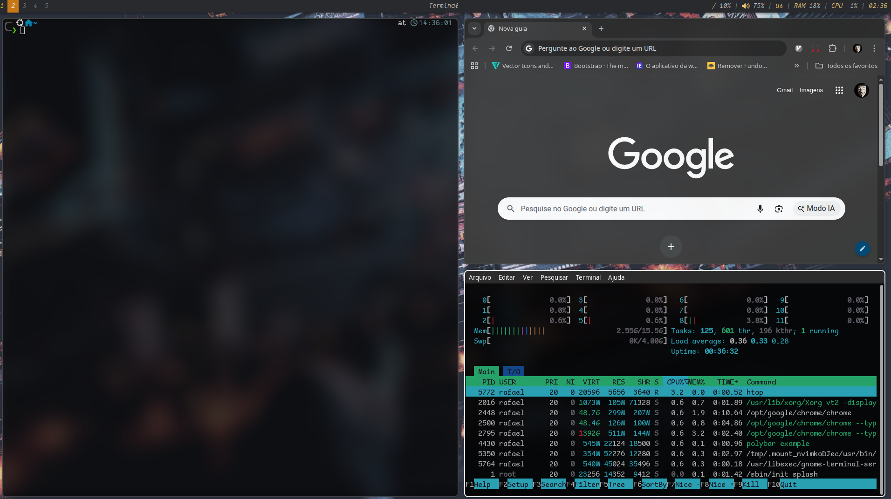

# 🧩 Meu Setup BSPWM (Arch Linux)

Configuração completa do meu ambiente Linux usando **bspwm**, **sxhkd** e **polybar**, com suporte a múltiplos monitores.

---

## 🚀 Instalação

```bash
git clone https://github.com/Rafael-TCampos/dotfiles-Bspwm.git dotfiles
cd dotfiles
chmod +x install.sh
./install.sh
```

Depois:

```bash
startx
```

---

## 🖥️ Funcionalidades

* Window Manager: bspwm
* Atalhos: sxhkd
* Barra: polybar (multi-monitor)
* Compositor: picom
* Terminal: kitty
* Editor: neovim

---

## 🖥️ Monitores

Suporte a dual monitor com script automático (`dualMonitor.sh`)

---

## 📸 Preview



---

## ⚠️ Observações

* Feito para Arch Linux
* Pode precisar ajustar nomes de monitores (`xrandr`)

---

## 📦 Estrutura

```text
bspwm/
sxhkd/
polybar/
kitty/
nvim/
picom/
install.sh
dualMonitor.sh
```

